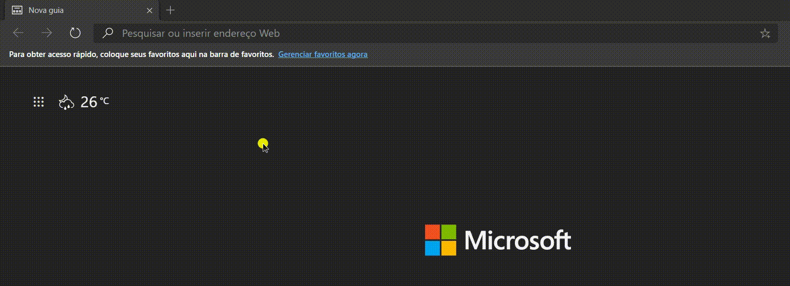

<h3 align="center">
  TypeScript: Aplicação simples exemplo TypeScript
</h3>

<p align="center">
  Desenvolvido durante o <a href="https://rocketseat.com.br/gostack">Bootcamp GoStack</a> da Rocketseat.
  <br />
  <br />
  <a href="#tecnologias">Tecnologias</a>&nbsp;&nbsp;&nbsp;|&nbsp;&nbsp;&nbsp;
  <a href="#rotas-da-aplicação">Rotas da aplicação</a>&nbsp;&nbsp;&nbsp;|&nbsp;&nbsp;&nbsp;
  <a href="#instalação-e-execução">Instalação e execução</a>
</p>

## Tecnologias

- [Node.js](https://nodejs.org/)
- [TypeScript](https://www.typescriptlang.org/)
- [Express](https://expressjs.com/)

<p align="center">
  
</p>

## Rotas da aplicação
- **`GET /user`**: Rota que retorna uma mensagem de Hello Word e informações de um Usuário;


## Instalação e execução

```bash
# Clone esse repositório
$ git clone https://github.com/cleyton1986/typescript-conceitos

# Entre no diretório
$ cd typescript-conceitos

# Instale as dependências
$ yarn

# Rode para "transpilar" os arquivos .ts em .js e rodar a aplicação
$ yarn start

# ou Rode só para "transpilar" os arquivos .ts
$ yarn build
```

## Licença

Esse projeto está sob a licença MIT.

---

Developed by 🖖🏽 Cleyton Alves 👨🏽‍💻 Inspired by RocketSeat 🚀